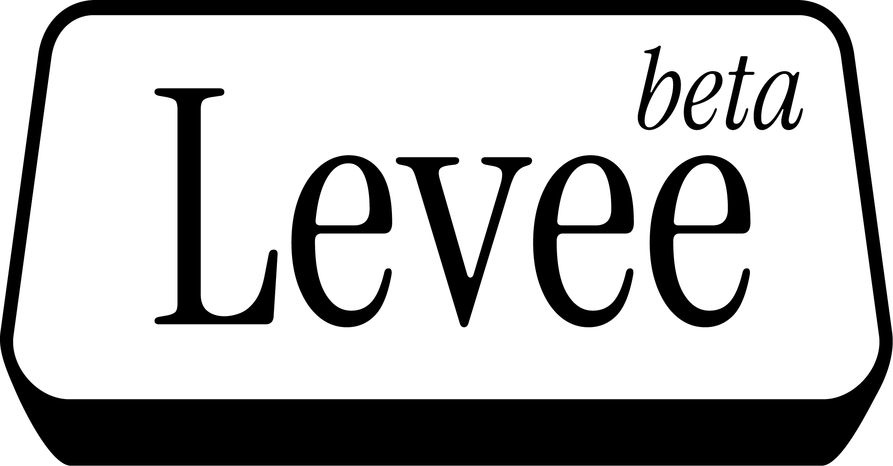

  

A minimal video player built for file-streaming workflows.

> [!NOTE]
> [Suite](https://www.suitestudios.io/) is currently the only supported cloud file streaming client — [LucidLink](https://www.lucidlink.com/) support lands in the next release.

---

## What it does

**Levee** plays your footage and generates **linked proxies and thumbnails stored on your cloud-streamed drive**. Anyone on your team running Levee gets them instantly — so a huge ProRes 4444 file over a slow connection becomes something a reviewer can scrub through in seconds. Generate once, review everywhere.

It's designed to be your default player: double-click a file and it just plays.

## Features

- Linked proxy generation (quarter-res H.264), shared across the team
- Auto-generated thumbnails in the library browser
- In-app pre-cache controls (per asset or folder)
- Embedded technical metadata (codec, resolution, framerate, bit rate, timecode, audio, color space)
- One-key proxy ↔ original toggle
- Set as default player for supported types

## Supported files

Powered by **libmpv**, so it plays the professional codecs most players choke on.

| | |
|---|---|
| **Containers** | `.mov` `.mp4` `.mxf` `.mkv` `.avi` `.webm` |
| **Codecs** | ProRes (incl. 4444), DNxHR / DNxHD, XDCAM, H.264, H.265 / HEVC, VP9, AV1, and more |
| **Audio** | `.wav` `.aiff` `.flac` `.mp3` `.aac` `.ogg` |

## Install

Download the installer from [Releases](../../releases) and run it (per-user, no admin). Unsigned, so click **More info → Run anyway** if SmartScreen warns. Windows-only for now.

## How to use

1. **Open something** — double-click a file (if Levee's your default) or drag one in.
2. **Set your cloud drive** — library (📁) → ⚙️ → toggle your streaming drive on. Unlocks proxies and pre-caching.
3. **Make proxies** — press <kbd>P</kbd> on an asset, or **Generate All Proxies** for a folder. Once made, <kbd>P</kbd> flips between proxy and original.
4. **The rest** — browse with 📁, right-click to pre-cache, info panel (bottom-right) for metadata.

### Keyboard shortcuts

| Key | Action |
|-----|--------|
| <kbd>Space</kbd> / <kbd>K</kbd> | Play / pause |
| <kbd>J</kbd> / <kbd>L</kbd> | Back / forward 15 seconds |
| <kbd>,</kbd> / <kbd>.</kbd> | Previous / next frame |
| <kbd>H</kbd> / <kbd>;</kbd> | Previous / next file |
| <kbd>-</kbd> / <kbd>=</kbd> | Slower / faster |
| <kbd>P</kbd> | Toggle proxy ↔ original |

## Roadmap

**Next up:** LucidLink integration.

**Later releases:** macOS client · headless Linux client for proxy generation · maybe an Enterprise version.

**Other ideas:** Premiere extension to link proxies · archive / file-moving tools.

## License

Levee is free and open source under the **[AGPL-3.0-or-later](LICENSE)**. Use it, modify it, and even sell products built on it — just keep them open under the same license. See **[LICENSING.md](LICENSING.md)** for details and third-party component notes.

---

Made with ♥ in Dallas, TX by Alex Bagheri

